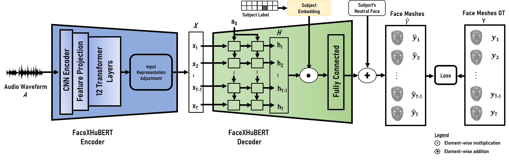

# INFOMCANIM-Face-Challenge (2024-25)

### This repository is made only for academic purposes in order to facilitate an assignment for Computer Animation master course at Utrecht University. 
### This repository contains the implementation of the baseline model (FaceXHuBERT) to be trained on Multiface dataset. The original paper details are as follows- 

>_FaceXHuBERT: Text-less Speech-driven E(X)pressive 3D Facial Animation Synthesis using Self-Supervised Speech Representation Learning_.

> Authors: Kazi Injamamul Haque, Zerrin Yumak

> [[Paper]](https://dl.acm.org/doi/pdf/10.1145/3577190.3614157) [[Project Page]](https://galib360.github.io/FaceXHuBERT/) [[Video]](https://www.youtube.com/watch?v=AkBhnNOxwE4&ab_channel=KaziInjamamulHaque)

> Given a raw audio file, FaceXHuBERT generates and renders expressive 3D facial animation. We recommend visiting the project [website](https://galib360.github.io/FaceXHuBERT/) and watching the supplementary [video](https://www.youtube.com/watch?v=AkBhnNOxwE4&ab_channel=KaziInjamamulHaque).

<p align="center">

</p>

## Environment

- Windows (tested on both Windows 10 and 11)
- Python 3.8
- PyTorch 1.10.1+cu113

## Dependencies

- Check the required python packages and libraries in `environment.yml`.
- [ffmpeg](https://ffmpeg.org/download.html) for Windows. [WikiHow link on how to install](https://www.wikihow.com/Install-FFmpeg-on-Windows)

## Get Started 

It is recommended to create a new anaconda environment with Python 3.8. To do so, please follow the steps sequentially- 
- Ensure that [CUDA](https://developer.nvidia.com/cuda-11-5-0-download-archive?target_os=Windows&target_arch=x86_64&target_version=10&target_type=exe_local) computing toolkit with appropriate [cudnn](https://developer.nvidia.com/rdp/cudnn-archive) (tested with CUDA 11.5) is properly installed in the system and the environment variable "CUDA_PATH" is set properly. First install CUDA, then download, extract, and copy the cudnn contents in the CUDA installation folder (e.g. C:\Program Files\NVIDIA GPU Computing Toolkit\CUDA\v11.5). 
- Install [Anaconda](https://www.anaconda.com/products/distribution) for Windows.
- Insatall ffmpeg. [WikiHow link on how to install ffmpeg](https://www.wikihow.com/Install-FFmpeg-on-Windows)
- Clone this repository.
- Open Anaconda Promt CLI.
```
cd <repository_path>
```
- Then run the following command in the Anaconda promt  

```
conda create --name FaceXHuBERT python=3.8
conda activate FaceXHuBERT
pip install setuptools==62.6.0
conda env update --file environment.yml
pip install torch==1.10.1+cu113 torchvision==0.11.2+cu113 torchaudio==0.10.1+cu113 -f https://download.pytorch.org/whl/torch_stable.html

```
- Please make sure you run all the python scripts below from the activated virtual environments command line (in other words, your python interpreter is the one from FaceXHuBERT environment you just created).


## Data
### Multiface

The pre-processed [Multiface](https://github.com/facebookresearch/multiface/tree/main) dataset can be downloaded from [HERE](https://solisservices-my.sharepoint.com/:u:/g/personal/k_i_haque_uu_nl/EZ60UlOt4eJEmccaW4VfU9IBjNO14QNWDjQVigoc2hPb_A). Uncompress the `multiface.zip` file and put the `multiface` folder in `data/` directory. You can run the `render_GT_multiface.py` to render the ground truth data that will be saved in `data/multiface/renders/` directory. To do so, from repository root directory, run the following commands- 
```
cd data/multiface
python render_GT_multiface.py
```


## Model Training 

### Training and Testing

- Train the model by running the following command from root directory of the repository:

	```
	python main.py
	```
	The test split predicted results will be saved in the `result/`. The trained models (saves the model in 25 epoch interval) will be saved in the `save/` folder.

### Visualization

- Run the following command to render the predicted test sequences stored in `result/`:

	```
	python render_result.py
	```
	The rendered videos will be saved in the `renders/render_folder/videos_with_audio/` folder.
	
### Evaluation

- Quantitative/Objective evaluation script is provided in `evaluation/` folder. Run this following commands in CLI to compute the evaluation metrics:

	```
	cd evaluation
	python compute_objective_metrics.py
	```


## Demo (use your trained model to generate facial animation)

After training, the trained model will be saved in `save/` folder. You can use that now to generate facial animation given any audio file (in .wav format). 

- Given a raw audio file (wav_path), animate the mesh and render the video by running the following command: 
    ```
    python predict.py --subject 7 --condition 1 --wav_path "demo/wav/test.wav"
    ```

- The `predict.py` will run and generate the rendered videos in the `demo/render/video_with_audio/` folder. The prediction data will be saved in `demo/result/` folder. Try playing with your own audio file (in .wav format), other subjects and conditions. 


## For the assignment
- Train FaceXHuBERT on multiface dataset, evaluate, generate results that will be needed for the user study later. 
- Define your own model. (e.g.- The FacexHuBERT baseline model is defined in `faceXhubert.py`. You will define and implement your own model and create `<yourmodel>.py`).
- Train your model, evaluate and generate results to be used for the user study. 

## Additional Resources
- [FaceDiffuser Project](https://uuembodiedsocialai.github.io/FaceDiffuser/)
- [ProbTalk3D Project](https://uuembodiedsocialai.github.io/ProbTalk3D/)

## Suggestion
- Use you favorite IDE for development (e.g. [PyCharm Community](https://www.jetbrains.com/help/pycharm/installation-guide.html)).